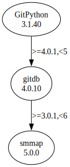

# Third Party Dependencies

<!--[[[fill sbom_sha256()]]]-->
The [SBOM in CycloneDX v1.4 JSON format](https://git.sr.ht/~sthagen/lumikko/blob/default/sbom/cdx.json) with SHA256 checksum ([b1d32633 ...](https://git.sr.ht/~sthagen/lumikko/blob/default/sbom/cdx.json.sha256 "sha256:b1d32633ca26358fde4bad6ffb904ca4b1fb9c6b9f85baf1441411e967f472ad")).
<!--[[[end]]] (checksum: 5c7f070378fb4cfa7bbca093ef6a075a)-->
## Licenses 

JSON files with complete license info of: [direct dependencies](direct-dependency-licenses.json) | [all dependencies](all-dependency-licenses.json)

### Direct Dependencies

<!--[[[fill direct_dependencies_table()]]]-->
| Name                                                           | Version                                              | License     | Author                         | Description (from packaging data)                                    |
|:---------------------------------------------------------------|:-----------------------------------------------------|:------------|:-------------------------------|:---------------------------------------------------------------------|
| [GitPython](https://github.com/gitpython-developers/GitPython) | [3.1.32](https://pypi.org/project/GitPython/3.1.32/) | BSD License | Sebastian Thiel, Michael Trier | GitPython is a Python library used to interact with Git repositories |
<!--[[[end]]] (checksum: 0d8e82c3240dae4beaa71e5fcec668d1)-->

### Indirect Dependencies

<!--[[[fill indirect_dependencies_table()]]]-->
| Name                                                   | Version                                          | License     | Author          | Description (from packaging data)                                   |
|:-------------------------------------------------------|:-------------------------------------------------|:------------|:----------------|:--------------------------------------------------------------------|
| [gitdb](https://github.com/gitpython-developers/gitdb) | [4.0.10](https://pypi.org/project/gitdb/4.0.10/) | BSD License | Sebastian Thiel | Git Object Database                                                 |
| [smmap](https://github.com/gitpython-developers/smmap) | [5.0.0](https://pypi.org/project/smmap/5.0.0/)   | BSD License | Sebastian Thiel | A pure Python implementation of a sliding window memory map manager |
<!--[[[end]]] (checksum: f03261aff3e39e81702abf0193a194dd)-->

## Dependency Tree(s)

JSON file with the complete package dependency tree info of: [the full dependency tree](package-dependency-tree.json)

### Rendered SVG

Base graphviz file in dot format: [Trees of the direct dependencies](package-dependency-tree.dot.txt)



### Console Representation

<!--[[[fill dependency_tree_console_text()]]]-->
````console
GitPython==3.1.32
└── gitdb [required: >=4.0.1,<5, installed: 4.0.10]
    └── smmap [required: >=3.0.1,<6, installed: 5.0.0]
````
<!--[[[end]]] (checksum: 8106b75862a20c336fea7df8edca29dc)-->
